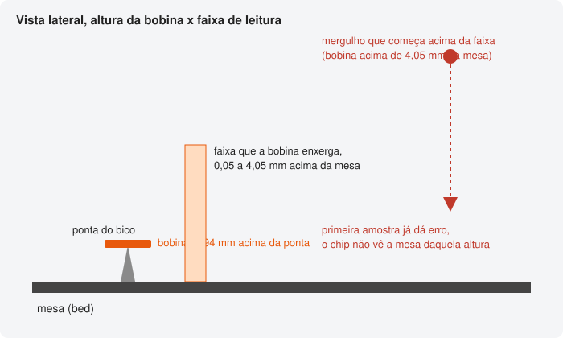
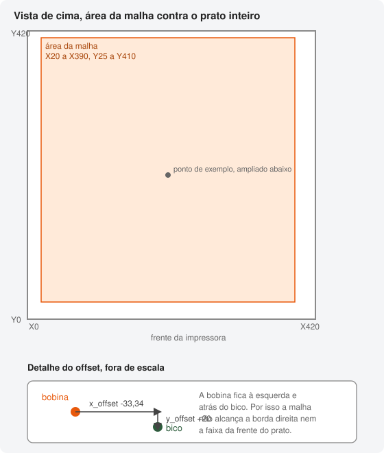

# BTT Eddy Duo on the Elegoo Neptune 4 Max

Author [@Igor3DPrint](https://instagram.com/igor3dprint)

> **This guide uses the driver that comes with Klipper (`probe_eddy_current`), and it is still valid:
> this is where you start.** Two things changed on the reference machine after it was written, on
> 03/09/2026, and you should know them before reading:
>
> - It moved to **[eddy-ng](EDDY-NG.en.md)**, where the Z-offset measures itself on every print. If
>   your final goal is to stop calibrating Z, install it first by following this document and then go
>   to [EDDY-NG.en.md](EDDY-NG.en.md).
> - The **nozzle-cleaning pad was removed** from the machine. The nozzle-cleaning macros mentioned
>   later (`LIMPAR_BICO`, `PURGA_BAMBU`, `EDDY_OFFSET_FULL`) still exist in the configuration, but
>   nothing calls them anymore. They are not an error; they are history.

This guide covers installing the BTT Eddy Duo probe on the Neptune 4 Max running modern Klipper. It
is written in the order things happen, with the numbers I measured on my machine and the mistakes I
made before reaching them.

A summary before anything else. The parameter that cost me the most time was the coil drive current,
`reg_drive_current`. With it wrong, the sensor reports a failure even with the nozzle at the right
distance, and the error message points to the wrong place. It is in [topic 9](#9-the-drive-current).

> Saw `Eddy current sensor error`? Run `LDC_CALIBRATE_DRIVE_CURRENT CHIP=btt_eddy` before changing
> any height. The command does not move the machine, so it is safe to run at any time, and this is the
> most common cause of that error on this machine. Full detail in [topic 9](#9-the-drive-current).

---

## Topics

1. [Hardware I used](#1-hardware-i-used)
2. [Printed part](#2-printed-part)
3. [How the Eddy appears on the computer](#3-how-the-eddy-appears-on-the-computer)
4. [What the Eddy does and does not do](#4-what-the-eddy-does-and-does-not-do)
5. [The three mounting measurements](#5-the-three-mounting-measurements)
6. [The base configuration](#6-the-base-configuration)
7. [The calculations that prevent sensor errors](#7-the-calculations-that-prevent-sensor-errors)
8. [The calibration order](#8-the-calibration-order)
9. [The drive current](#9-the-drive-current)
10. [Four Neptune 4 Max traps](#10-four-neptune-4-max-traps)
11. [Homing and the first-home ritual](#11-homing-and-the-first-home-ritual)
12. [The dense mesh](#12-the-dense-mesh)
13. [Macros I use day to day](#13-macros-i-use-day-to-day)
14. [How to measure whether the calibration came out good](#14-how-to-measure-whether-the-calibration-came-out-good)
15. [Symptom table](#15-symptom-table)

---

## 1. Hardware I used

**BTT Eddy Duo** probe, from BigTreeTech. The Duo version connects over **USB**, directly to the
printer board or to the host. It does not need a data wire connected to the Neptune motherboard,
which simplifies the installation a lot.

It appears in Klipper as a separate MCU, with its own serial.

```ini
[mcu eddy]
serial: /dev/serial/by-id/usb-Klipper_rp2040_SEU_ID_AQUI-if00
```

To discover your ID, with the probe plugged in, run this inside the printer.

```bash
ls /dev/serial/by-id/
```

---

## 2. Printed part

The mount that holds the Eddy on the Neptune 4 extruder carriage, the only STL needed for this
build.

https://www.printables.com/model/928061-neptune-4-btt-eddy-adapter

Print it in **ABS or ASA**. The part sits close to the hot nozzle and near the heated bed, and PLA
softens and deforms in that temperature range, which takes the precision out of the geometry that
holds the probe. PETG is a middle ground and still creeps under sustained heat.

There are two variants in the model, one straight and one at ninety degrees. I printed and used the
straight one. Choose based on the clearance left on your carriage, because the variant changes the
adapter position and with it the coil mounting height, and that height goes into every calculation
in [topic 7](#7-the-calculations-that-prevent-sensor-errors). Measure your height after mounting. Do
not copy mine.

It takes **2 M3 heat-set inserts**, melted in with a soldering iron.

---

## 3. How the Eddy appears on the computer

This point deserves attention because it is where many people get stuck before even starting.

The **BOOT button on the Eddy Duo is on the top side of the board**. It does not appear on the
computer by itself when you only plug in the cable. The sequence that works is this.

1. With the USB cable disconnected, press and hold the BOOT button
2. Without releasing the button, plug the USB cable into the computer
3. Release the button



Now it appears, and you can flash Klipper firmware to it.

If you plug in USB first and only then press the button, it does not enter flashing mode. That is
what happened to me on the first try, and I spent a while thinking the board was defective.

After it is flashed, it starts appearing normally in `/dev/serial/by-id/` every time the printer
turns on, without needing any button.

---

## 4. What the Eddy does and does not do

The Eddy measures distance through eddy current induced in a coil. It reads fast, repeats well, and
does not touch anything.

The limitation almost nobody warns you about is range. It sees **only the last few millimeters**. On
my machine, the calibrated range goes from 0.05 mm to 4.05 mm. Above that, the chip does not see the
bed, sets the error bits, and Klipper aborts.

That leads to the sentence that summarizes the whole guide.

> The Eddy does not work by itself as a Z endstop.

A mechanical endstop triggers from any height. The Eddy does not trigger, because from far away there
is no reading to compare.

On the Neptune 4 Max this matters, because the factory `[stepper_z]` uses
`endstop_pin: probe:z_virtual_endstop`, meaning the probe is the only Z reference the machine has.
If you remove the original probe when installing the Eddy, as I did, you create a loop. To home, the
nozzle needs to be close, and to know it is close, Z needs to be homed.

[Topic 11](#11-homing-and-the-first-home-ritual) shows how to break that loop. If you can keep the
original probe installed in parallel, keep it, and you skip that entire topic.

One detail fooled me. After removing the old probe, its pin remains on the board and remains being
read. An input with a pull-up resistor and nothing plugged in floats high, which makes Klipper
believe an endstop is triggered. Do not trust what the pin reports; trust what is bolted to the
machine.

> **Do not try to use the removed probe's pin as an endstop.** I tried it here, pointing
> `[stepper_z]` to the old probe pin with the end empty. The axis went down and did not stop, because
> the pin held high by pull-up never changes state, and I had to cut power to the printer. Only use
> that pin again after you have a real sensor bolted to its end.

---

## 5. The three mounting measurements

After bolting the adapter on, you need three numbers. Getting any of them wrong makes the whole mesh
measure the wrong place.

### Coil height

Touch the nozzle to the bed and measure how far the face of the coil sits above the tip of the
nozzle. Mine was **0.94 mm**. BigTreeTech recommends between two and three millimeters.

I went lower by choice, and that reduces maneuvering clearance. With 0.94 mm, when the nozzle is
three millimeters from the bed, the coil is at 3.94 mm, almost at the 4.05 mm limit it can see.

Save that number, because it goes into every calculation in the next topic.

```
coil height = nozzle height + mounting height
```



The image shows why a probing descent that starts above that range fails on the first sample: the
chip has no reading to compare at that height.

### X offset

Measure from the center of the nozzle to the center of the coil, horizontally. Mine measured
**33.34 mm**.

The sign is confusing. The rule I use is to look at `[stepper_x]` in `printer.cfg`. With
`position_endstop: 0` and `homing_positive_dir: false`, the endstop is on the side where X equals
zero, meaning the left side. If the coil is on the same side as the endstop, it sits left of the
nozzle, and `x_offset` is **negative**.

In my case it became `x_offset: -33.34`.

### Y offset

This is the one almost everyone assumes is zero. I assumed that too, and later redid a whole mesh
because of it. Measure.

On mine, the Eddy sits **behind** the nozzle and measured **20 mm**. Behind means the coil covers a
point on the plate with a larger Y than the nozzle's Y, so `y_offset` is **positive**.

In my case it became `y_offset: 20`.

I ran a full mesh with `y_offset` at zero when the correct value was twenty. Every point was measured
twenty millimeters away from its intended place. The mesh looked normal on screen and was wrong
everywhere.

---

## 6. The base configuration

I keep the Eddy in a separate file called `eddy.cfg`, with an `[include eddy.cfg]` in `printer.cfg`.
That makes it easier to compare and roll back.

```ini
[mcu eddy]
serial: /dev/serial/by-id/usb-Klipper_rp2040_SEU_ID_AQUI-if00

[probe_eddy_current btt_eddy]
sensor_type: ldc1612
i2c_mcu: eddy
i2c_bus: i2c0f
x_offset: -33.34
y_offset: 20
speed: 5.0
samples: 2
samples_result: median
sample_retract_dist: 1.0

[bed_mesh]
speed: 200
horizontal_move_z: 2.5
mesh_min: 20,25
mesh_max: 390,410
probe_count: 6,6
algorithm: bicubic
bicubic_tension: 0.2
mesh_pps: 2, 2
fade_start: 5.0
fade_end: 30.0
```

Notice that **there is no `z_offset` in this block**, and that is intentional. The reason is in
[trap 4](#trap-4-z_offset-written-by-hand-locks-save_config).

### Why mesh_max does not cover the whole plate

The plate is 420 mm, but the measurable area is smaller, and the probe geometry is why. Klipper
calculates it like this.

```
nozzle position = mesh point minus the axis offset
```

With `x_offset: -33.34`, the nozzle needs to go to `point + 33.34`. X `position_max` is 430.1, so the
rightmost measurable point is around 396. I use 390 to leave margin, which takes the nozzle to
423.34.

With `y_offset: 20`, the nozzle goes to `point - 20`. A Y `mesh_min` of 25 takes the nozzle to 5,
almost touching the front stop.

The lower X limit has a reason too. With `mesh_min` in X below 20, the coil would pass over the
cleaning pad, which is seven millimeters tall, during the scan.



---

## 7. The calculations that prevent sensor errors

Three inequalities. Call `F` the top of the calibrated range, which on my machine is 4.05, and `M`
the coil mounting height, which on mine is 0.94.

```
z_offset + sample_retract_dist   <  F
horizontal_move_z + M            <  F
starting height for the descent + M <  F
```

If any of them overflows, the sensor will report an error at some point in the cycle, and the symptom
will look like something completely different.

### First calculation, sample_retract_dist

With `samples: 2`, Klipper probes, rises by this amount, and probes again. The trigger happens with
the coil reading the `z_offset` value. If the retract is too large, the second probe starts outside
the range.

The factory default is 3.0. With `z_offset` near 2.0, that gives 5.0 and overflows. I use **1.0**.

### Second calculation, horizontal_move_z

This is the nozzle height while traveling between mesh points. Add the mounting height to know where
the coil is.

The ten-millimeter default would put the coil at 10.94 mm, blind. I use **2.5**, which results in
3.44 mm.

### Third calculation, the starting height for the descent

This is defined by the `z_hop` in `safe_z_home`, or by your `homing_override`. With a 0.94 mm mount,
starting the descent at three millimeters leaves the coil at 3.94 mm, inside the range but with
little margin.

---

## 8. The calibration order

This is the part I did in the wrong order and that cost me a whole night.

1. Write the base configuration with the measured offsets
2. Calibrate the drive current with `LDC_CALIBRATE_DRIVE_CURRENT CHIP=btt_eddy` and run
   `SAVE_CONFIG`
3. Only then build the table with `PROBE_EDDY_CURRENT_CALIBRATE CHIP=btt_eddy` and run `SAVE_CONFIG`
4. Test homing
5. After that, the mesh

Never the opposite, and never only one of the two calibrations.

The drive current defines the signal amplitude, and changing it shifts all frequencies. If you build
the table first and change the current afterward, the table is no longer valid.

The worst part is that it does not warn you. It starts triggering at the wrong height, which means
nozzle against the sheet.

> Changed `reg_drive_current`, the table is dead. Redo `PROBE_EDDY_CURRENT_CALIBRATE` before sending
> any `G28`.

---

## 9. The drive current

**This is the parameter that knocks the most people down on this machine.** If you came here directly
from a sensor error, read this whole topic before changing any height, retract, or offset.

The LDC1612 excites the coil with a configurable current called `reg_drive_current`, which is an
integer from zero to thirty-one. It needs to match your coil, your mounting height, and your bed.

Current that is **too high** saturates the amplitude. Current that is **too low** kills the signal.
In both cases, the chip sets an error bit and Klipper returns this.

```
Error during homing z: Eddy current sensor error
```

Here is the trap. That message sounds like it says the sensor is far from the bed, and that is not
what it reports. In my case the nozzle was at two millimeters, inside the range, and the error still
happened. I spent hours changing height, bed temperature, and retract distance, when the problem was
the signal gain.

If you want to confirm at the source, the error starts in the firmware, in `src/sensor_ldc1612.c`.

```c
if (data > 0x0fffffff) {
    // Sensor reports an issue - cancel homing
    ld->homing_flags = 0;
    trsync_do_trigger(ld->ts, ld->error_reason);
    return;
}
```

The four high bits are the chip's own error bits. Notice that the test comes **before** any movement,
so it aborts on the first sample. That is why the symptom looks like "it does not go down and already
errors". Also notice that this has no relation to the `calibrate` table, because the hardware is
complaining; Klipper is not comparing numbers.

### How to measure without moving the machine

There is a command that makes the chip itself choose the right value, in the position where it
already is, without moving anything.

```
LDC_CALIBRATE_DRIVE_CURRENT CHIP=btt_eddy
```

The response appears in the console.

```
probe_eddy_current btt_eddy: reg_drive_current: 16
```

Compare it with what is in your configuration. In my case it was eighteen and the chip wanted
sixteen. A two-point difference locked everything up.

The number is not fixed forever. After remounting the probe and remeasuring `x_offset` and
`y_offset`, I ran the command again and it pointed back to eighteen. Treat any value in this guide as
a snapshot, not a constant. Every time the physical mount changes, measure again before trusting the
old number, yours or mine.

### Where this command lives

If you look for this command inside `probe_eddy_current.py`, you will not find it, and it is easy to
conclude your Klipper fork does not have it. It lives in `ldc1612.py`, which is the chip driver.

```bash
grep -n "LDC_CALIBRATE_DRIVE_CURRENT" ~/klipper*/klippy/extras/ldc1612.py
```

I almost abandoned this line of investigation because I searched in the wrong file.

### After measuring

Run `SAVE_CONFIG`. The printer restarts with the new value. Then redo the table, as shown in
[topic 8](#8-the-calibration-order). Do not skip that part.

---

## 10. Four Neptune 4 Max traps

Listed in the order they appeared here, because one hid the next. If you have
`Eddy current sensor error` and already checked the height, it is very likely one of these.

### Trap 1, the printer declares itself zeroed at boot

In the Neptune `printer.cfg` and `plr.cfg`, this block exists.

```ini
[delayed_gcode KINEMATIC_POSITION]
initial_duration: 3.0
gcode:
      SET_KINEMATIC_POSITION X=110
      SET_KINEMATIC_POSITION Y=110
      SET_KINEMATIC_POSITION Z=0
```

A few seconds after power-up, Klipper starts believing Z is at zero, with the nozzle physically
thirty millimeters from the bed. When you send `G28`, `safe_z_home` concludes Z is already homed,
that zero is lower than `z_hop`, and **raises** the nozzle to "three", which in real life is
thirty-three. The coil sees nothing and aborts.

The symptom is very characteristic. It homes X and Y, returns to the middle, does not descend, and
immediately errors.

Comment out the whole block in both files. It appears duplicated, and the one that counts is the one
in `printer.cfg`, because it comes later in the read order. Commenting only one does not solve it.

The same block is also the root cause of the Z-offset that appears ignored on this machine, with the
full explanation in
[Z-OFFSET.md](Z-OFFSET.md#2-a-impressora-se-declara-zerada-alguns-segundos-depois-de-ligar-sem-ter-homeado).

### Trap 2, an old Z compensation applied blindly

I had this in `printer.cfg`, from when I used the contact probe.

```ini
[gcode_macro G28]
rename_existing: G28.1
gcode:
    G28.1 {rawparams}
    SET_GCODE_OFFSET Z=-1.95
```

After changing probes, it kept being applied. Every `G0 Z` started going down 1.95 mm more than I
commanded. That is how I dragged the nozzle across the sheet while trying to position manually.

Check the active value on your machine now.

```bash
curl -s "http://SEU_IP/printer/objects/query?gcode_move" | grep -o '"homing_origin": \[[^]]*\]'
```

If the third number is not `0.0`, there is a hidden offset eating into your descent. Zero it before
sending any manual Z movement.

### Trap 3, the retract between the two homing passes

`[stepper_z]` comes with `homing_retract_dist: 5`.

Klipper hits the trigger, rises by that much, and makes a second slow pass to confirm. With the
trigger at two millimeters of reading, rising five takes the coil to seven, outside the range. The
second pass starts blind and the chip aborts.

The symptom is deceptive because the **first pass works**. You see the machine descend, touch, and
only then error. It looks like a trigger problem and is a retract problem.

I use **1.5**, which leaves the coil at 3.5 mm.

### Trap 4, z_offset written by hand locks SAVE_CONFIG

If you write `z_offset` in `eddy.cfg`, which is an included file, every `SAVE_CONFIG` after a
`PROBE_CALIBRATE` will fail with this message.

```
SAVE_CONFIG section 'probe_eddy_current btt_eddy' option 'z_offset' conflicts with included value
```

Klipper does not autosave over a value that came from an include. Calibration runs, shows the new
number, and cannot save it.

The solution is to leave `z_offset` out of `eddy.cfg` and allow it to live in the autosave block at
the end of `printer.cfg`. If you are migrating from a configuration that already had the value
written by hand, remove the line from the included file and add the value to the autosave block.

```
#*# [probe_eddy_current btt_eddy]
#*# z_offset = 0.300
#*# reg_drive_current = 18
```

---

## 11. Homing and the first-home ritual

If your original probe was removed, the first `G28` after power-up cannot work by itself, because
there is no Z reference and the coil only sees four millimeters.


What works, and is safe, is homing X and Y first and then **descending while watching**.

```
G28 X Y
G0 X215 Y215 F6000
```

Now lower Z from the panel, watching the nozzle, until it is about two millimeters from the bed. Use
steps of ten only while it is clearly far away, then one, then zero point one. Then:

```
G28 Z
```

After that, Z is homed, and the printer works normally until you turn it off.

> Never send an absolute `G0 Z` to a height calculated in your head while Z is not trustworthy. That
> is exactly how I dragged the nozzle. Small step, eyes on the nozzle, and stop if it touches.

### Separating travel clearance from descent height

If you have something tall on the bed near the origin, like the cleaning pad, the `z_hop` in
`safe_z_home` creates a deadlock. It is both the travel clearance to the endstop and the starting
height for the descent. You need high clearance for travel and low height for probing, and one number
does not solve both.

The way out is to replace `safe_z_home` with a `homing_override`.

```ini
[homing_override]
axes: xyz
gcode:
    
    
    
        SET_KINEMATIC_POSITION Z=0
    
    G91
    G0 Z16 F600
    G90
    
        G28 X
    
    
        G28 Y
    
    
        
            { action_raise_error("Z has no reference. The Eddy only sees up to 4mm, so blind descent does not work. X and Y are already homed. Lower the nozzle from the panel to about 2mm from the bed and run G28 Z.") }
        
        G0 X239.25 Y194.55 F6000
        G91
        G0 Z-16 F600
        G90
        G28 Z
    
```

Adjust `G0 X239.25 Y194.55` to your machine's probing point.

This version gained a guard. When Z has no reference at all, it homes X and Y normally and **stops**,
with written instructions instead of diving blindly. That turns a confusing `Eddy current sensor
error` into a message that says what to do: lower the nozzle from the panel until it is near the bed
and run `G28 Z` by hand, as described at the start of this topic.

The logic in plain English. It rises sixteen millimeters relative, which is safe from any height,
including with virgin Z. It homes X and Y with full clearance over the pad. It returns to the probing
point. It descends the same sixteen millimeters relative, putting the nozzle exactly back at the
height it left from. Then it probes.

Notice that **there is no descent to an absolute height** inside here. I did write a version that
descended to Z equal to three when Klipper thought Z was known, and that is dangerous, because a
reference declared by hand with `SET_KINEMATIC_POSITION` also counts as known. The descent would turn
into a dive of dozens of millimeters into the bed.

Whoever knows Z itself is trustworthy, like a print-start macro that just homed, positions itself
before calling `G28 Z`.

`safe_z_home` and `homing_override` cannot coexist. Comment out one to use the other.

---

## 12. The dense mesh

A contact probe takes almost a second per point. The Eddy scans in continuous motion, and this is
where it pays for itself. You can measure thousands of points in the time the bed takes to stabilize.

```ini
[gcode_macro EDDY_MALHA]
description: Dense mesh of the whole usable area. Ex, EDDY_MALHA BED=50 SOAK=300
variable_pontos: 70
gcode:
    
    
    
    
    M117 Heating the bed
    M140 S{bed}
    TEMPERATURE_WAIT SENSOR=heater_bed MINIMUM={bed - 1} MAXIMUM={bed + 1}
    M117 Soak
    G4 P{soak * 1000}
    M117 Homing
    G28
    BED_MESH_CLEAR
    M117 Scanning the bed
    _BED_MESH_CALIBRATE METHOD=rapid_scan HORIZONTAL_MOVE_Z=2.5 PROBE_COUNT={n},{n} MESH_PPS=0 SCAN_SPEED=200
    M400
    RESPOND TYPE=command MSG="Mesh ready. Run SAVE_CONFIG to save."
```

Normal use.

```
EDDY_MALHA
SAVE_CONFIG
```

That is 4900 points over an area of 370 by 385 millimeters, about 5.3 mm spacing. Against the factory
six by six, which gives seventy-three millimeters of spacing, the difference is large.

Three notes that apply to any machine.

`rapid_scan` is only enabled when the probe is of type `probe_eddy_current`. With a contact probe,
Klipper falls back to the normal method without warning.

`HORIZONTAL_MOVE_Z` is the **nozzle** height during the scan, not the coil height. Redo the
calculation from [topic 7](#7-the-calculations-that-prevent-sensor-errors) with your mounting
height.

The routine time is mostly soak, and soak is what makes the mesh worth anything. A cold bed measures
one surface; a stabilized bed measures another. A half-hour routine with five minutes of scanning is
time well spent.

---

## 13. Macros I use day to day

### Nozzle cleaning on the pad

Runs the nozzle over the silicone pad. Accepts parameters so it can be reused in other contexts.

```ini
[gcode_macro LIMPAR_BICO]
description: Cleans the nozzle on the pad
variable_x: 2.5
variable_y_ini: 5
variable_y_fim: 30
variable_z: 6.0
variable_passadas: 10
variable_temp: 150
gcode:
    
    
    
    
        { action_raise_error("LIMPAR_BICO, axes not homed") }
    
    
        M109 S{t}
    
    G90
    G0 Z{c.z + 6} F1200
    G0 X{c.x} Y{c.y_ini} F6000
    G0 Z{c.z} F600
    
        G0 Y{c.y_fim} F6000
        G0 Y{c.y_ini} F6000
    
    G0 Z{c.z + 10} F1200
```

With `TEMP=0`, it does not change temperature, which allows calling it in the middle of a print.

`variable_z` sits one millimeter below the height of the pad, which gives the interference that makes
the scraping happen. With a seven-millimeter pad, I use six.

### Block purge in the dead corner

Drops old filament in a corner and then cleans the nozzle. It is the Bambu collector idea adapted.

```ini
[gcode_macro PURGA_BAMBU]
description: Block purge in the corner and clean the nozzle. Ex, PURGA_BAMBU Q=50
variable_x: 0
variable_y: 45
variable_z: 15
variable_quantidade: 50
variable_velocidade: 150
variable_altura_segura: 15
gcode:
    
    
    
        { action_raise_error("PURGA_BAMBU, axes not homed") }
    
    
        { action_raise_error("PURGA_BAMBU, nozzle too cold to extrude") }
    
    SAVE_GCODE_STATE NAME=purga_bambu
    G90
    G0 Z{c.altura_segura} F1200
    G0 X{c.x} Y{c.y} F6000
    G0 Z{c.z} F600
    M83
    G1 E{q} F{c.velocidade}
    G1 E-1.5 F2100
    G4 P1500
    G0 Z{c.altura_segura} F1200
    LIMPAR_BICO TEMP=0 PASSADAS=4
    G92 E0
    RESTORE_GCODE_STATE NAME=purga_bambu MOVE=1 MOVE_SPEED=200
```

Purge height changes the result a lot. At two millimeters, the material forms a blob stuck to the
sheet. At fifteen millimeters, it comes out as a strand and barely touches, which is close to Bambu's
behavior. I use fifteen.

I took the volume from the Bambu Lab A1's own start gcode, which runs `G1 E50 F200`. It repeats that
block twice when changing material in the AMS. With no color change, one block is enough.

### Purge line in the dead strip

The block purge alone is not enough to prime the nozzle for the first layer, so I added a purge line
in the strip the mesh does not cover.

```ini
[gcode_macro LINHA_PURGA]
description: Purge line in the dead strip on the left side of the bed
variable_x_ida: 2.5
variable_x_volta: 3.1
variable_y_ini: 60
variable_y_fim: 300
variable_z: 0.4
variable_extrusao: 52
gcode:
    
    G90
    M83
    G0 X{c.x_ida} Y{c.y_ini} Z{c.z} F6000
    G1 Y{c.y_fim} E{c.extrusao} F1200
    G0 X{c.x_volta}
    G1 Y{c.y_ini} E{c.extrusao} F1200
    G92 E0
```

It runs at X2.5, with the return pass at X3.1, from Y60 to Y300, at 0.4 mm height, with E52 per pass.
That is double the normal flow, on purpose.

The position is not accidental. `mesh_min` in X is 20, so everything below that is already outside
the mesh. The strip starts at Y60, twenty-five millimeters after the end of the cleaning pad, which
occupies up to Y35.

### Live z-offset adjustment

The probe `z_offset` has the sign inverted compared with intuition. A larger value moves the nozzle
closer to the bed. I got that direction wrong the first time and almost crashed the nozzle, so I
wrapped it in macros whose names describe what happens to the nozzle.

```ini
[gcode_macro SOBE]
description: Moves the nozzle away from the bed. Ex, SOBE P=0.05
gcode:
    
    
    SET_GCODE_OFFSET Z_ADJUST={p} MOVE={m}

[gcode_macro DESCE]
description: Moves the nozzle closer to the bed. Ex, DESCE P=0.05
gcode:
    
    
    SET_GCODE_OFFSET Z_ADJUST=-{p} MOVE={m}

[gcode_macro ZOFFSET_SALVAR]
description: Saves the session adjustment into the probe z_offset and restarts
gcode:
    
        RESPOND TYPE=error MSG="Nothing to save; the session adjustment is zero."
    
        Z_OFFSET_APPLY_PROBE
        SAVE_CONFIG
    
```

With the part printing the first layer, keep sending `SOBE` until it looks good, then
`ZOFFSET_SALVAR`. Judging by the real result works better than judging by paper.

### Complete z-offset routine

Homes, heats the nozzle to soften anything stuck to it, tells it to cool while cleaning, and opens
manual adjustment at the temperature where the machine will print.

```ini
[gcode_macro EDDY_OFFSET_FULL]
description: Homes, cleans the nozzle and opens z-offset adjustment
variable_temp_limpeza: 200
variable_temp_offset: 150
variable_passadas: 20
gcode:
    
    G28
    M109 S{c.temp_limpeza}
    M104 S{c.temp_offset}
    M106 S255
    LIMPAR_BICO TEMP=0 PASSADAS={c.passadas}
    TEMPERATURE_WAIT SENSOR=extruder MAXIMUM={c.temp_offset + 2}
    M106 S0
    G90
    G0 Z10 F1200
    G0 X215 Y215 F6000
    G0 Z3 F600
    PROBE_CALIBRATE
```

Cleaning happens while the nozzle cools, with the fan on to speed it up. Measuring the offset with
the nozzle at one hundred and fifty degrees is intentional, because a hot nozzle is expanded, and
that is how it will be while printing.

### Keeping the bed warm between prints

This machine's bed is slow to heat. Keeping it warm while the printer is idle removes most of the
preheat wait from the next print.

```ini
[delayed_gcode MANTER_MESA_50]
initial_duration: 15
gcode:
    
        M140 S50
    
    UPDATE_DELAYED_GCODE ID=MANTER_MESA_50 DURATION=60
```

It rearms itself every sixty seconds, does nothing while the printer is printing or paused, and never
lowers a target that is already above 50. A PETG print at 80 degrees stays at 80, and only returns to
50 when the print ends.

Two caveats. With this macro active, the bed never cools down by itself, because it always starts
heating back to 50. And a manual `M140 S0` only holds for one minute, until the macro's next cycle
turns the heater back on.

### PRINT_START, the print opening

The order of these steps matters, and each exists for a specific reason.

```ini
[gcode_macro PRINT_START]
gcode:
    
    
    G92 E0
    G90
    CLEAR_PAUSE
    M140 S{bed}
    
        G28
    
    SAVE_VARIABLE VARIABLE=was_interrupted VALUE=True
    LIMPAR_BICO
    M104 S{extr}
    M190 S{bed}
    G4 P5000
    M109 S{extr}
    G90
    G0 Z3 F600
    G28 Z
    BED_MESH_PROFILE LOAD=default
    PURGA_BAMBU Q=50
    LINHA_PURGA
    G92 E0
```

It tells the bed to heat without waiting, homes if needed, and cleans the nozzle at 150 degrees while
the bed is still rising. Nozzle cleaning and bed heating happen at the same time, and that is the
whole point of the design: it costs no extra time. Only after that come the final temperatures, the
soak, hot Z rehome, mesh loading, block purge, and purge line.

Two lessons are embedded here and deserve explanation.

The line `SAVE_VARIABLE VARIABLE=was_interrupted` must come **after** homing, never before. When it
was the first line of the macro, a homing failure left the printer marked as having an interrupted
print even though no print had started, and every next print attempt answered `SD busy`.

The explicit `G0 Z3` before `G28 Z` exists because whoever calls the macro already knows Z itself is
trustworthy at that point, something the `homing_override` from
[topic 11](#11-homing-and-the-first-home-ritual) never assumes by itself.

### Filament change

`M600` pauses the print and retracts 80 mm so the filament can be pulled out by hand, refusing the
retract below 170 degrees. After loading the new filament, `RESUME` runs `PURGA_BAMBU Q=100`, cleans
the nozzle on the pad, and returns to the part. There is no purge line on the way back; it only runs
at the start of the print.

It is worth recording what this routine replaced: a blind `G1 E100 F200` executed wherever the
carriage was stopped, dumping 100 mm of filament on top of the part and shaking the carriage in X
while trying to clean.

### Start gcode in OrcaSlicer

The whole print opening lives in the `PRINT_START` macro, so the slicer only needs to pass the two
temperatures. In OrcaSlicer, the field is in Machine, then Custom G-code, then Start G-code.

```
;ELEGOO NEPTUNE 4 MAX 0.6
M220 S100
M221 S100
G90
M82
PRINT_START BED=[bed_temperature_initial_layer_single] EXTRUDER=[nozzle_temperature_initial_layer]
```

Do not leave any `M190` or `M109` before that call, because that destroys the overlap between nozzle
cleaning and bed heating that `PRINT_START` was designed to do. And turn off all slicer purging, both
purge line and purge tower, or the printer purges twice.

The placeholders above use Orca and Prusa style. In Cura, the equivalent is
`{material_bed_temperature_layer_0}` and `{material_print_temperature_layer_0}`.

---

## 14. How to measure whether the calibration came out good

At the end of `PROBE_EDDY_CURRENT_CALIBRATE`, Klipper reports the standard deviation.

```
probe_eddy_current: stddev=67.901 in 2482 queries
```

That number by itself does not say much, because it is in hertz. To know what it means as distance,
take the table saved at the end of `printer.cfg` and see how many hertz correspond to one millimeter
at the height where the trigger happens.

On mine, between 1.5 and 2.5 mm, the curve moves 23422 hertz per millimeter.

```
67.9 divided by 23422 = 0.0029 mm
```

About three microns of repeatability at the trigger height, which is better than any contact probe I
have used.

Also check two properties of the table.

It needs to be **monotonic**, with frequency falling continuously as height rises, without any
inversion. If there is an inversion, the drive current is wrong and you go back to
[topic 9](#9-the-drive-current).

And sensitivity **falls as height rises**. On mine, 47672 hertz per millimeter near the bed against
12849 at the top of the range. That is not a defect; it is the nature of the sensor, and it explains
why it turns into an error when you try to use it from far away.

---

## 15. Symptom table

Always start with the first line of this table. Wrong `reg_drive_current` is the most common cause of
`Eddy current sensor error` on this machine, and testing it costs one command that does not move
anything.

| Symptom | Likely cause | Where to look |
|---|---|---|
| **`Eddy current sensor error`, at any height, even inside the calibrated range** | **Wrong `reg_drive_current`. Test first, before changing any height** | [Topic 9](#9-the-drive-current) |
| Homes XY, returns to the middle, does not descend and errors | False home at boot leaving Z high | [Trap 1](#trap-1-the-printer-declares-itself-zeroed-at-boot) |
| Descends, touches, and only then errors | `homing_retract_dist` too large | [Trap 3](#trap-3-the-retract-between-the-two-homing-passes) |
| Every Z movement descends more than commanded | Old `SET_GCODE_OFFSET` active | [Trap 2](#trap-2-an-old-z-compensation-applied-blindly) |
| `SAVE_CONFIG` refuses with "conflicts with included value" | `z_offset` written in an included file | [Trap 4](#trap-4-z_offset-written-by-hand-locks-save_config) |
| Second `PROBE` sample fails | `sample_retract_dist` overflowing the range | [Topic 7](#7-the-calculations-that-prevent-sensor-errors) |
| Error during the mesh, between points | `horizontal_move_z` overflowing the range | [Topic 7](#7-the-calculations-that-prevent-sensor-errors) |
| First layer crooked on only one side | Wrong `y_offset` or assumed zero | [Topic 5](#5-the-three-mounting-measurements) |
| Trigger at the wrong height after changing current | Table not redone | [Topic 8](#8-the-calibration-order) |
| Endstop reading triggered with the nozzle in the air | Removed probe pin floating high | [Topic 4](#4-what-the-eddy-does-and-does-not-do) |
| Eddy does not appear on the computer for flashing | BOOT button was not pressed before USB | [Topic 3](#3-how-the-eddy-appears-on-the-computer) |

### Two operation details

`FIRMWARE_RESTART` does not always reload the configuration. When you suspect that, force it through
the service and confirm by reading back what was loaded.

```bash
curl -s -X POST "http://SEU_IP/machine/services/restart?service=klipper"
```

If you keep the bed heated while idle, turn the heater off a few seconds before restarting the
service. Restarting with an active heater drops the MCU with
`Scheduled digital out event will exceed max_duration`. The shutdown cuts the heater, so there is no
risk, but you do need to turn it back on.

---

## License and warranty

No warranty. Changing probes carries a risk of driving the nozzle into the sheet, and you are the one
next to the printer. Go slowly, watch the nozzle, and stop when something looks wrong.
